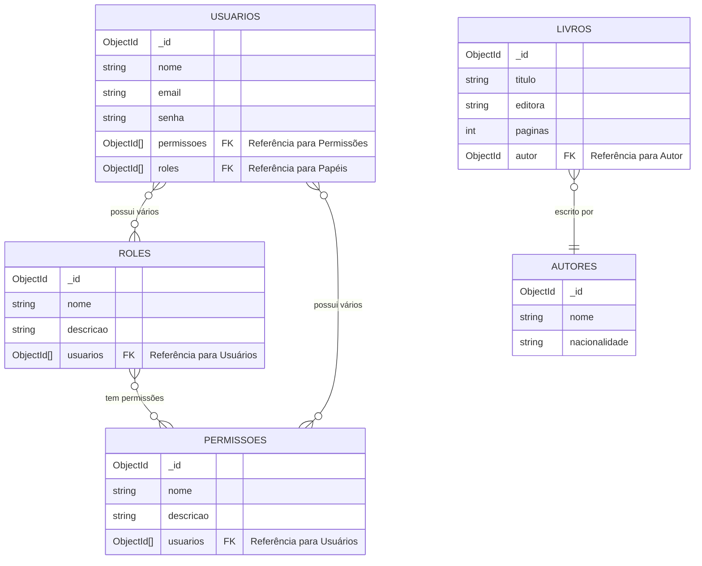

# Livraria API com Node.js

Projeto em Andamento!
Este projeto foi criado usando Node 20.15.0

## Sobre o Projeto

Este projeto é uma API para gerenciamento de uma livraria, desenvolvida com Node.js. A API permite o cadastro, atualização, exclusão e consulta de livros, além de gerenciar autores.
O objetivo é servir como base para projetos de APIs RESTful com boas práticas, fácil manutenção e escalabilidade.

### Funcionalidades Principais

- Gerenciamento de livros (CRUD: criar, ler, atualizar e deletar).
- Gerenciamento de autores.
- Integração com banco de dados MongoDB para persistência dos dados.

## Tecnologias Utilizadas

- **Node.js**: Ambiente de execução para JavaScript no servidor.
- **Express**: Framework web para criação de rotas e gerenciamento da API.
- **MongoDB**: Banco de dados NoSQL utilizado para armazenar informações sobre livros, autores e categorias.
- **Mongoose**: ODM (Object Data Modeling) para interação com o MongoDB.
- **Dotenv**: Gerenciamento de variáveis de ambiente, como chaves secretas e URLs de banco de dados.
- **Nodemon**: Ferramenta de desenvolvimento que reinicia automaticamente o servidor quando alterações são detectadas.
- **Swagger**: Biblioteca Open Api 3 que gera a documentação dos endpoints do projeto.

## Estrutura de Banco de Dados - Livraria API



# Iniciando o projeto

Para iniciar a aplicação execute a seguinte ação na pasta raiz

Instale as dependências do npm com o comando:

```shell script
npm install
```

Para iniciar a aplicação execute a seguinte ação na pasta raiz

```shell script
npm run dev
```

Consultar documentação da Api:

```shell script
http://localhost:3000/api-docs
```

## Autor
<b>Thallyta Macedo Carvalho de Castro</b>

Linkedin: https://www.linkedin.com/in/thallyta-castro/

Medium: https://medium.com/@thallyta-castro-cv

email: thallytacastro.dev@gmail.com
