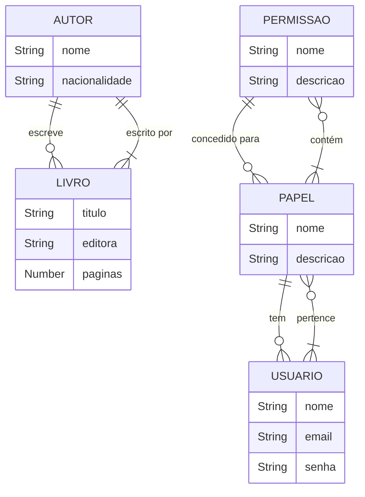

# Livraria API com Node.js

Projeto em Andamento!
Este projeto foi criado usando Node 20.15.0

## Sobre o Projeto

Este projeto é uma API para gerenciamento de uma livraria, desenvolvida com Node.js. A API permite o cadastro, atualização, exclusão e consulta de livros, além de gerenciar autores.
O objetivo é servir como base para projetos de APIs RESTful com boas práticas, fácil manutenção e escalabilidade.

# Funcionalidades Principais

## 1. Gerenciamento de Livros (CRUD: Criar, Ler, Atualizar e Deletar)
- **Criação de Livros**: Permite adicionar livros com detalhes como título, editora, número de páginas e autor. Além disso, valida se os campos obrigatórios estão preenchidos e garante que os dados inseridos estão dentro das faixas de valores permitidas (ex: número de páginas).
- **Leitura de Livros**: Implementa filtros de busca para exibir livros por autor, título ou editora. Permite paginação e ordenação para facilitar a navegação em grandes volumes de dados.
- **Atualização de Livros**: Permite a atualização dos campos de um livro já existente, garantindo que o livro existe antes de permitir qualquer modificação. Também deve há uma verificação para garantir que os dados sejam válidos antes de salvar as alterações.
- **Deleção de Livros**: Permite a remoção de livros, e adiciona uma verificação para garantir que o livro esteja relacionado a um autor e não esteja sendo utilizado em outras funcionalidades (por exemplo, exclusão de registros dependentes).

## 2. Gerenciamento de Autores (CRUD: Criar, Ler, Atualizar e Deletar)
- **Criação de Autores**: Permite que os dados dos autores sejam inseridos corretamente, validando campos como o nome do autor e a nacionalidade. 
- **Leitura de Autores**: Implementa a busca por autor sem a opção de filtros
- **Atualização de Autores**: Fornece a capacidade de atualizar dados do autor, como nome e nacionalidade. Como o autor pode estar vinculado a livros, garante que as alterações não afetem negativamente esses relacionamentos.
- **Deleção de Autores**: Implementa a exclusão segura dos autores, considerando que a exclusão de um autor deve afetar todos os livros relacionados a ele.

## 3. Criação de Roles e Permissões
- **Criação de Roles**: Permiti que os administradores criem papéis (roles) com permissões específicas (leitura, escrita, atualização e exclusão de livros ou autores, por exemplo). Além disso, garante que os papéis tenham descrições claras e objetivas para fácil identificação.
- **Atribuição de Permissões**: Associa permissões aos papéis de maneira flexível, permitindo a modificação das permissões conforme as necessidades da equipe. Isso inclui a criação de permissões para acessar ou modificar dados de livros e autores, ou outras funcionalidades do sistema.

## 4. Integração com Banco de Dados MongoDB para Persistência dos Dados
- **Conexão Segura com MongoDB**: Configura a conexão com o MongoDB de forma segura utilizando variáveis de ambiente e boas práticas de configuração. Implementa uma conexão robusta que seja capaz de lidar com falhas e reinicializações de forma eficiente.
- **Estruturação do Banco de Dados**: Define esquemas e relações de dados (por exemplo, um autor pode ter múltiplos livros, e cada livro pode ter múltiplos usuários). Além disso, garantir que as referências entre coleções (como entre `livros`, `autores` e `roles`) sejam bem estruturadas e normalizadas.
- **Validação e Sanitização de Dados**: Utiliza a validação de dados do Mongoose para garantir que os dados inseridos no banco de dados sejam válidos (como validadores de e-mail, string, número de páginas, etc.). Além disso, implementar a sanitização de entradas para evitar injeções de código ou dados maliciosos.

## Outras funcionalidades
- **Autenticação e Autorização**: Garante que apenas usuários com permissões adequadas possam acessar ou modificar os dados dos livros, autores e papéis. Isso é feito usando autenticação baseada em JWT (JSON Web Tokens) e middleware de autorização.

- **API RESTful**: Cria APIs RESTful com endpoints claros e bem definidos para todas as operações (CRUD). Utiliza boas práticas de versionamento de API e garante que as respostas sejam padronizadas e contenham informações suficientes (como status codes adequados).


## Tecnologias Utilizadas

- **Node.js**: Ambiente de execução para JavaScript no servidor.
- **Express**: Framework web para criação de rotas e gerenciamento da API.
- **MongoDB**: Banco de dados NoSQL utilizado para armazenar informações sobre livros, autores e categorias.
- **Mongoose**: ODM (Object Data Modeling) para interação com o MongoDB.
- **Dotenv**: Gerenciamento de variáveis de ambiente, como chaves secretas e URLs de banco de dados.
- **Nodemon**: Ferramenta de desenvolvimento que reinicia automaticamente o servidor quando alterações são detectadas.
- **Swagger**: Biblioteca Open Api 3 que gera a documentação dos endpoints do projeto.
- **Bcryptjs**: Biblioteca para criptografia de senhas.
- **Jsonwebtoken (JWT)**: Biblioteca para implementação de autenticação baseada em tokens JSON.

## Estrutura de Banco de Dados - Livraria API



# Iniciando o projeto

Para iniciar a aplicação execute a seguinte ação na pasta raiz

Instale as dependências do npm com o comando:

```shell script
npm install
```

Para iniciar a aplicação execute a seguinte ação na pasta raiz

```shell script
npm run dev
```

Consultar documentação da Api:

```shell script
http://localhost:3000/api-docs
```

## Autor
<b>Thallyta Macedo Carvalho de Castro</b>

Linkedin: https://www.linkedin.com/in/thallyta-castro/

Medium: https://medium.com/@thallyta-castro-cv

email: thallytacastro.dev@gmail.com
